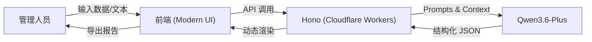

# GovInsight-AI (RA) 重复诉求智能分析系统

<div align="center">

**GovInsight-AI RA**
**Smart Repetitive Appeal Pattern Analysis System**

[](CHANGELOG.md)
[](https://www.gnu.org/licenses/gpl-3.0)


[简体中文](#简体中文) | [English](#english-introduction)

</div>

---

<a name="简体中文"></a>

**GovInsight-AI (RA)** 是专门面向政务热线（如 12345）管理场景设计的**重复诉求智能分析引擎**。它专注于解决政务热线中“同人高频重复诉求”的甄别难、定性难、处置难等痛点。

通过引入 **Qwen3.6-Plus** 大模型，系统能够像资深分析员一样，深度解析诉求人的行为模式、诉求实质与情绪演变，自动识别 A-H 八大类行为模式，并为管理人员提供分级处置建议，实现从“被动应对”向“主动治理”的跨越。

## 📖 项目背景与痛点

在政务热线日常运行中，约有 15%-20% 的工单属于重复诉求。这些重复诉求往往交织着复杂的原因，传统人工分析模式面临巨大挑战：

*   **🕵️‍♂️ 行为识别难**：难以区分是“问题未解的正当反复”还是“无理缠诉的恶意骚扰”。
*   **🔗 关联分析难**：诉求往往跨越多个部门、多个时间点，人工难以梳理出完整的逻辑链条。
*   **⚖️ 处置尺度不一**：对于“情绪驱动”或“特殊关怀”类诉求，缺乏统一的研判标准，容易导致处置过度或处置不足。
*   **⚠️ 风险预警滞后**：对职业诉求或群体性苗头的识别往往依赖于事后复核，缺乏事中实时研警。

**GovInsight-AI (RA)** 将 LLM 的语义理解与行为建模能力引入重复诉求分析环节，实现对复杂行为模式的全量、实时、客观研判。

## ✨ 核心价值与功能

### 1. 🧠 智能行为研判 (A-H 八大分类)
系统基于严谨的政务业务逻辑，将重复行为精准归类：
*   **【A类】真实高频诉求**：问题持续未解，正当反复。**（重点保障）**
*   **【B类】情绪驱动型**：不满情绪导致短时间集中提交。
*   **【C类】衍生扩展型**：因核心诉求不满，延伸投诉关联问题。
*   **【D类】代理集中型**：代表群体统一反映共同问题。
*   **【E类】功能测试型**：有意设计场景验证系统响应。
*   **【F类】职业诉求型**：以施压、曝光或获取补偿为目的。
*   **【G类】恶意骚扰型**：以占用资源、干扰考核为目的。
*   **【H类】特殊关怀型**：疑似存在精神健康或认知问题。**（人文关怀）**

### 2. 📊 多维度深度分析
*   **基础统计**：自动提取总量、周期、涉及部门及高相似工单分布。
*   **时间规律分析**：识别批量提交、定时触发或阶段性爆发规律，判断是否符合自然诉求规律。
*   **内容相似性分析**：识别句式雷同或换角度表达，分析评价内容是否模板化。
*   **覆盖广度与关联性**：梳理跨部门投诉的逻辑主线，识别“顺藤摸瓜”式衍生路径。

### 3. 🛡️ 分级处置建议
系统根据研判结果，自动输出三层处置建议：
*   **针对诉求人**：提供情绪安抚、专人督办或法律告知建议。
*   **针对热线系统**：提供预警规则设置、数据隔离或满意度标注建议。
*   **针对办理部门**：提供跨部门联办、流程漏洞修复或服务质量改进建议。

### 4. 📄 专业分析报告
*   **执行摘要**：200字内精简总结，供领导快速决策。
*   **A4 纸质感预览**：模拟正式公文排版，支持 Markdown 导出，方便存档与流转。

## 🏗️ 系统架构

本项目采用全栈 Serverless 架构，确保高性能与零运维成本。



## �️ 技术栈

*   **前端**: 原生 HTML5, CSS3 (Tailwind 风格), JavaScript (ES6+), Marked.js
*   **后端**: [Hono Framework](https://hono.dev/), OpenAI SDK
*   **运行时**: [Cloudflare Pages Functions](https://developers.cloudflare.com/pages/platform/functions/)
*   **模型**: Qwen3.6-Plus (Aliyun DashScope)

## � 快速开始

### 1. 环境准备
*   Node.js (v18+)
*   npm

### 2. 安装与运行
```bash
# 安装依赖
npm install

# 配置环境变量 (在 wrangler.toml 中)
# QWEN_API_KEY = "你的密钥"

# 启动开发服务器
npm run dev
```
访问 `http://localhost:8788` 即可进入系统。

### 3. 模拟测试
系统内置了 **20 条真实的 12345 热线重复诉求案例**，点击页面上的“开始分析”即可一键体验完整的 AI 研判流程。

## 📄 许可证

本项目采用 [GNU GPL v3.0](LICENSE) 许可证。

---

<a name="english-introduction"></a>
## English Introduction

**GovInsight-AI (RA)** is a professional **Repetitive Appeal Pattern Analysis System** designed for government service hotlines (e.g., 12345). It leverages the **Qwen3.6-Plus** LLM to identify behavioral patterns (Categories A-H), analyze core concerns, and provide tiered disposal recommendations for high-frequency callers.

### ✨ Key Features
1. **Smart Categorization**: Accurately classifies appeals into 8 categories including Real High-Frequency, Emotion-Driven, and Professional Claimants.
2. **Deep Insights**: Analyzes temporal patterns, content similarity, and cross-departmental logical links.
3. **Tiered Recommendations**: Provides actionable advice for citizens, systems, and departments.
4. **Professional Reporting**: Generates A4-style Markdown reports for official use.

---

<div align="center">
Copyright © 2026 Huotao. All Rights Reserved.
</div>
