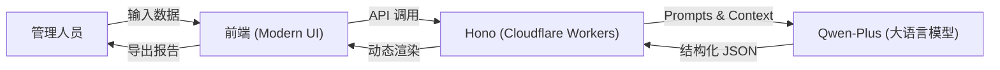

<div align="center">

# GovInsight-AI (RA) 重复诉求智能分析系统

**GovInsight-AI RA**
**Smart Repetitive Appeal Pattern Analysis System**

[](CHANGELOG.md)
[](https://www.gnu.org/licenses/gpl-3.0)


[简体中文](#简体中文) | [English](#english-introduction)

</div>

---

<a name="简体中文"></a>

**GovInsight-AI (RA)** 是专门面向政务热线（如 12345）管理场景设计的**重复诉求智能分析引擎**。它专注于解决政务热线中“同人高频重复诉求”的甄别难、定性难、处置难等痛点。

通过引入先进的**大语言模型 (LLM)**，系统能够像资深分析员一样，深度解析诉求人的行为模式、诉求实质与情绪演变，自动识别 A-H 八大类行为模式，并为管理人员提供分级处置建议。

## 📖 项目背景与痛点

在政务热线日常运行中，约有 15%-20% 的工单属于重复诉求。这些重复诉求往往交织着复杂的原因，传统人工分析模式面临巨大挑战：

*   **🕵️‍♂️ 行为识别难**：难以区分是“问题未解的正当反复”还是“无理缠诉的恶意骚扰”。
*   **🔗 关联分析难**：诉求往往跨越多个部门、多个时间点，人工难以梳理出完整的逻辑链条。
*   **⚖️ 处置尺度不一**：对于“情绪驱动”或“特殊关怀”类诉求，缺乏统一的研判标准，容易导致处置过度或不足。
*   **⚠️ 风险预警滞后**：对职业诉求或群体性苗头的识别往往依赖于事后复核，缺乏事中实时预警。

## ✨ 核心价值与功能

### 1. 🧠 智能研判计分 (Scoring Mechanism)
系统引入 LLM 语义理解能力，对每一组重复诉求进行多维度“计分”与定性研判：

*   **行为模式分类 (A-H 八大维度)**：
    *   **【A类】真实高频诉求**：问题持续未解，正当反复。**（重点保障，计分权重：高）**
    *   **【B类】情绪驱动型**：不满情绪导致短时间集中提交。
    *   **【C类】衍生扩展型**：因核心诉求不满，延伸投诉关联问题。
    *   **【D类】代理集中型**：代表群体统一反映共同问题。
    *   **【E类】功能测试型**：有意设计场景验证系统响应。
    *   **【F类】职业诉求型**：以施压、曝光或获取补偿为目的。
    *   **【G类】恶意骚扰型**：以占用资源、干扰考核为目的。**（风险预警，计分权重：高）**
    *   **【H类】特殊关怀型**：疑似存在精神健康或认知问题。**（人文关怀，审慎判定）**

*   **多维度计分因子**：
    *   **时间规律分**：分析提交间隔（24h内/48h外）、频率曲线，判断是否符合自然诉求规律。
    *   **内容相似度**：识别“模板化复制”与“带有新事实的递进描述”。
    *   **结论置信度 (Confidence Score)**：AI 输出 0-100 的置信度得分，辅助人工快速定位。

### 2. 📊 深度分析视图
*   **基础统计**：自动提取总量、周期、涉及部门及高相似工单分布。
*   **时间链路视图**：把重复诉求从“列表”转成“事件链”，识别递进关系与阶段性爆发。
*   **智能报告生成**：自动输出包含执行摘要、统计分析、行为研判在内的专业 Markdown 报告。

### 3. 🛡️ 分级处置建议
系统根据研判得分，输出三层处置建议：
*   **针对诉求人**：提供情绪安抚、专人督办或法律告知建议。
*   **针对热线系统**：提供预警规则设置、数据隔离或满意度标注建议。
*   **针对办理部门**：提供跨部门联办、流程漏洞修复或服务质量改进建议。

## 🏗️ 系统架构

本项目采用全栈 Serverless 架构，确保高性能与零运维成本。



## 🗺️ 路线图 (Roadmap)

*   ✅ **V0.1**: 基础分析功能与 A-H 分类研判。
*   ✅ **V0.2**: 置信度评估、时间链路视图与 Markdown 报告导出。
*   ⬜ **V0.3**: 支持多诉求人批量导入分析、可视化图表增强。
*   ⬜ **V0.4**: 接入语音转文字分析、集成更多政务业务知识库。

## 🛠️ 技术栈

*   **前端**: 原生 HTML5, CSS3 (Tailwind 风格), JavaScript (ES6+), Marked.js
*   **后端**: [Hono Framework](https://hono.dev/), OpenAI SDK
*   **运行时**: [Cloudflare Pages Functions](https://developers.cloudflare.com/pages/platform/functions/)
*   **模型**: 默认使用 Qwen-Plus (支持所有 OpenAI 兼容接口)

## 🚀 快速开始

### 1. 环境准备
*   Node.js (v18+)
*   npm

### 2. 安装与运行
```bash
# 安装依赖
npm install

# 启动开发服务器
npm run dev
```

### 3. 环境变量配置
在 Cloudflare Pages 面板或 `.dev.vars` 中配置：
*   `QWEN_API_KEY`: 你的密钥
*   `QWEN_BASE_URL`: 接口地址
*   `QWEN_MODEL_NAME`: 模型名称 (默认 qwen-plus)

---

<a name="english-introduction"></a>

## English Introduction

**GovInsight-AI (RA)** is a professional **Repetitive Appeal Pattern Analysis Engine** designed for government hotline management. It specializes in identifying, characterizing, and providing disposal recommendations for high-frequency repetitive appeals.

### ✨ Core Features
1.  **🧠 Intelligent Scoring**: Multidimensional scoring based on behavior patterns (Categories A-H), temporal patterns, and content similarity.
2.  **📊 Deep Analysis**: Automated extraction of statistics, temporal chain views, and professional Markdown reports.
3.  **🛡️ Tiered Disposal**: Tiered recommendations for petitioners, systems, and departments.

---

<div align="center">
Copyright © 2026 Huotao. All Rights Reserved.
</div>
